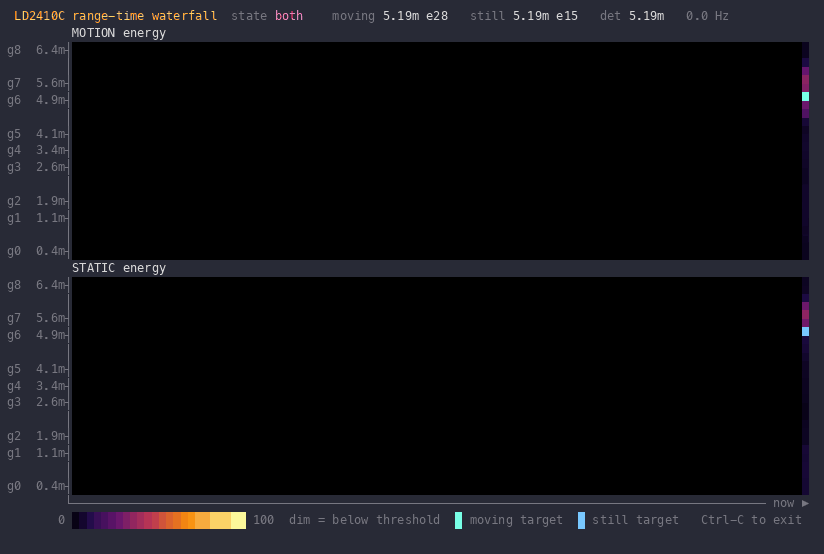

# mmwaver

Terminal tools for the HLK-LD2410C, a 24 GHz mmWave presence sensor that costs
a few dollars. Plug it into a USB serial adapter and mmwaver will show
you what it sees, draw it as a live range-time waterfall, and let you tune its
detection thresholds from the command line.



*`mmwaver -wf -sim`: a person walks in and stands still while a fan hums at gate 7.*

## What the sensor reports

The LD2410C splits the space in front of it into nine range gates of 0.75 m
each, out to about 6 m. Ten times a second it reports, per gate, how much
energy it saw from moving targets and from stationary ones (a breathing
person counts as stationary). Each gate has a motion threshold and a static
threshold. Energy above the threshold is a detection.

Most of the tuning work is figuring out which gate your ceiling fan lives in
and raising that gate's static threshold until it stops looking like a person.
The waterfall view makes that obvious.

## Hardware

Any 3.3 V logic USB to TTL adapter works. The CP2102 is cheap and common.

| LD2410C | Adapter |
|---|---|
| VCC | 5V |
| GND | GND |
| TX | RXD |
| RX | TXD |

Power it from the adapter's 5 V pin, not 3V3. The module needs 5 V on VCC;
its UART pins are 3.3 V logic, which is what the adapter expects. On macOS the port shows up as
`/dev/cu.usbserial-*`, on Linux as `/dev/ttyUSB*`.

## Install

```sh
go install github.com/jonfriesen/mmwaver@latest
```

Or clone and `go run .` from the repo. Go 1.27 or newer.

## Usage

Run with no arguments and mmwaver lists the serial ports it found and lets
you pick one with the arrow keys. Pass a port to skip the picker.

```sh
mmwaver                                # pick a port
mmwaver /dev/cu.usbserial-0001         # one line per second
mmwaver -eng /dev/cu.usbserial-0001    # per-gate energy bars, live
mmwaver -wf /dev/cu.usbserial-0001     # range-time waterfall
mmwaver -wf -sim                       # waterfall on fake data, no hardware
```

Ctrl-C exits and puts the sensor back in normal mode.

### Basic mode

The default prints one report per line:

```
state=both   moving= 77cm e= 94  still= 76cm e=100  det= 62cm
```

`state` is `none`, `moving`, `still`, or `both`. Distances are in centimetres,
energies 0 to 100.

Two flags shape the stream:

`-format text|json|csv` picks the line format. JSON is one object per line and
CSV starts with a header row. Both carry an RFC 3339 timestamp, so they pipe
cleanly into a log file or a `jq` filter.

`-interval` sets the minimum time between lines. The default is one second.
Pass `0` to print every report at the sensor's native 10 Hz.

```sh
mmwaver -format json -interval 0 /dev/cu.usbserial-0001 > presence.jsonl
```

### Engineering mode

`-eng` asks the sensor for per-gate energies and draws them as bars, one row
per gate, motion on the left and static on the right. The `|` in each bar
marks that gate's threshold, and a `*` next to the number means the gate is
currently over it.

### Waterfall

`-wf` is the same data as a scrolling heatmap: range on the vertical axis
with the sensor at the bottom, time on the horizontal axis with the newest
column at the right. Two panels, motion above static. Energy below the gate
threshold is dimmed so a detection stands out from background noise. It
redraws at whatever rate the sensor delivers and resizes with the terminal.

This is the view to use when tuning. A person walking toward the sensor is a
diagonal streak. A fan is a horizontal band that never moves.

### Tuning thresholds

`set-gate` writes new thresholds to the module. Whichever of `-motion` or
`-static` you leave out keeps its current value.

```sh
mmwaver set-gate -static 60 7 /dev/cu.usbserial-0001              # one gate
mmwaver set-gate -motion 50 -static 40 all /dev/cu.usbserial-0001 # every gate
mmwaver reset /dev/cu.usbserial-0001                              # factory defaults
```

After writing, it prints the full table so you can see what the module now
holds. Settings persist in the module's flash across power cycles. `reset`
restores the factory values and restarts the module.

Factory defaults, for reference:

| gate | range | motion | static |
|---|---|---|---|
| 0 | 0.00 to 0.75 m | 50 | 0 |
| 1 | 0.75 to 1.50 m | 50 | 0 |
| 2 | 1.50 to 2.25 m | 40 | 40 |
| 3 | 2.25 to 3.00 m | 30 | 40 |
| 4 | 3.00 to 3.75 m | 20 | 30 |
| 5 | 3.75 to 4.50 m | 15 | 30 |
| 6 | 4.50 to 5.25 m | 15 | 20 |
| 7 | 5.25 to 6.00 m | 15 | 20 |
| 8 | 6.00 to 6.75 m | 15 | 20 |

A static threshold of 0 on gates 0 and 1 means the sensor ignores stationary
targets within 1.5 m. Raise it if you want it to notice someone sitting
right in front of it.

### Baud rate

The module ships at 256000 baud and that is the default. If someone has
changed it with the vendor app, pass `-baud`. It applies to every mode and
subcommand. A wrong rate does not error, it just produces no reports.

### Simulator

`-sim` replaces the sensor with a synthetic one: a person walks in over six
seconds, stands still for six, walks out, and stands still again, while a
fan adds static noise at gate 7. It exists so the display code can be worked
on without hardware, and it is a quick way to see what the waterfall looks
like before you wire anything up.

## How it talks to the sensor

The LD2410C speaks a simple framed protocol over UART. Data reports are
`F4 F3 F2 F1 <len> <payload> F8 F7 F6 F5`. Commands and their ACKs use
`FD FC FB FA ... 04 03 02 01`. To change anything you send an enable-config
command, then the actual command, then end-config. Engineering mode is one of
those settings, so mmwaver turns it on at startup and off again on exit.

Everything lives in five files:

| file | what |
|---|---|
| `main.go` | frame parsing, commands, CLI, basic and engineering displays |
| `waterfall.go` | the waterfall renderer |
| `config.go` | `set-gate` and `reset` |
| `pick.go` | the serial port picker |
| `sim.go` | the synthetic sensor |

The protocol details come from the HLK LD2410 serial communication manual.

## Troubleshooting

Nothing prints. Check TX and RX are crossed, that the module is on 5 V, and
that you are using the `cu.` device on macOS rather than `tty.`. If it still
sits silent, the baud rate has probably been changed. Try `-baud 115200`.

`enable engineering mode: command 0x00FF: no ACK`. Same causes as above.

The waterfall looks garbled. It needs a terminal with Unicode and 24-bit
colour. iTerm2, kitty, WezTerm, and recent Terminal.app all work.

## License

MIT. See [LICENSE](LICENSE).
